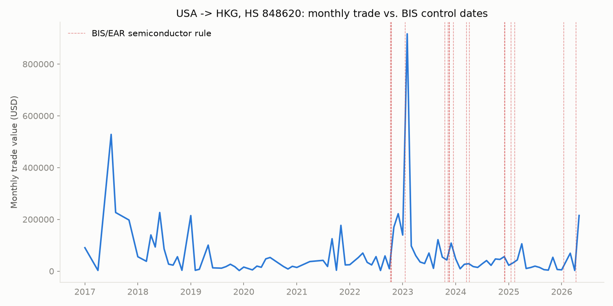

# Semiconductor Trade Diversion Risk: Singapore and Hong Kong

**Hong Kong's imports of semiconductor manufacturing equipment grew 10x in three
years — and 94% of what it re-exports now goes to China, up from 76% before US
export controls tightened.** A live, reproducible risk screen over real UN
Comtrade trade data, built end-to-end: data pipeline, auditable SQL scoring
model, and an analyst memo that survives its own rule-out checks.



**[Read the full memo →](analysis/findings.md)**

## The result

| Tier | Count | HS code x Hub |
|---|---|---|
| High | 0 | — |
| Elevated | 2 | HKG / semiconductor mfg. equipment, SGP / processors & controllers |
| Watch | 8 | — |
| Low | 2 | — |

Both "Elevated" flags looked identical on the mechanical screen. Driver analysis
pulled them apart: Hong Kong's flag holds up (no domestic fab industry exists to
explain the volume, and the re-export concentration on China keeps climbing every
year). Singapore's flag doesn't (its growth tracks a real, independently
documented $30B+ fab buildout — GlobalFoundries, UMC, Micron all expanding there
— and its China re-export share is falling, not rising). Reporting a finding that
*doesn't* survive scrutiny, right alongside the one that does, is the point: a
screen that flags everything is worthless.

## What this demonstrates

- **Data engineering under real-world constraints** — a resumable fetch pipeline
  (retry-with-backoff, per-call caching) against a public API that rate-limits
  aggressively, built after discovering live that the "obvious" paid-API path in
  the original project plan was unnecessary.
- **Auditable analytical logic** — the entire three-signal risk model lives in
  one readable SQL file ([`build_risk_score.sql`](src/build_risk_score.sql)), not
  a black-box model. Anyone can check the math against the conclusion.
- **Judgment under ambiguity** — HS trade codes get revised, agency API slugs
  don't match their public names, government data formats aren't documented
  accurately. Each of these got caught and fixed against a live source, not
  assumed from memory (see [Notes from the build](#notes-from-the-build)).
- **Knowing when a finding doesn't hold up** — the Singapore flag is reported and
  then explicitly ruled out with evidence, not quietly dropped. Same standard
  applied to a real, load-bearing data-integrity check on the US Census
  cross-validation, which turned out to confirm the pipeline rather than provide
  independent corroboration — and the memo says so plainly.

## How it works

Three-signal risk score per HS-code/hub combination, run against live UN
Comtrade bilateral trade data and a Federal Register-sourced timeline of BIS/EAR
export control actions since October 2022:

1. **Rate-of-growth gap** — corridor import growth vs. the hub's own overall
   trade growth, pre- vs. post-controls.
2. **Absorption gap** — hub imports minus re-exports to non-China destinations
   minus an estimated domestic-consumption baseline. What's left over is the
   unexplained volume.
3. **Event proximity** — does growth cluster right after a control date, or
   trend smoothly regardless of it.

Two signals aligning tiers a row "Elevated"; all three tiers it "High." Full
logic, with the reasoning behind every threshold, in
[`src/build_risk_score.sql`](src/build_risk_score.sql).

## Data sources — all live, none synthetic

- **[UN Comtrade](https://comtradeplus.un.org)** — HS6-level bilateral trade,
  2017-2025, pulled from the free public endpoint (no account needed — see
  [`fetch_comtrade.py`](src/fetch_comtrade.py)).
- **[US Census Bureau](https://www.census.gov/foreign-trade/)** — pipeline
  cross-check on the US-reported side ([`fetch_census.py`](src/fetch_census.py)).
- **[Federal Register](https://www.federalregister.gov)** — BIS/EAR rule
  effective dates and Entity List actions, pulled live
  ([`fetch_control_dates.py`](src/fetch_control_dates.py)).
- HS6 codes verified against the current UN Stats Classification Registry, not
  assumed from the original project brief (two of the originally-specified codes
  turned out not to exist under current nomenclature).

## Repository structure

```
supply-chain-diversion-risk/
  data/
    raw/                      <- downloaded Comtrade, Census, and Federal Register pulls
    processed/                <- tidy long-format trade table, event timeline table
  src/
    config.py                 <- HS code list, corridor definitions, API keys (gitignored)
    fetch_comtrade.py         <- pulls bilateral series from Comtrade (free preview endpoint)
    fetch_census.py           <- pulls US export cross-check data (requires CENSUS_API_KEY)
    fetch_control_dates.py    <- pulls BIS/EAR rule effective dates from Federal Register
    build_risk_score.sql      <- diversion risk scoring logic
    drivers.py                <- driver analysis and chart generation
  analysis/
    findings.md               <- the full memo
    charts/
  requirements.txt
  Makefile
```

## Running it

```
make all
```

Reproduces the full pipeline from a clean clone — fetch, parse, build the event
timeline, score, and driver analysis with charts. No cloud, no external services
beyond the public sources above.

## Notes from the build

A few things that only showed up by checking live sources instead of trusting
assumptions, kept here because they're representative of how the rest of the
project was built:

- The original plan assumed a paid Comtrade API key was required. It wasn't —
  the free public endpoint returns the same data; the paid key only matters at
  higher volume.
- Two of the originally-specified HS codes (`854242`, `854243`) don't exist
  under current WCO nomenclature. Caught by checking the UN Stats registry
  directly rather than trusting the code list as given.
- The Federal Register API's slug for the Bureau of Industry and Security is
  `industry-and-security-bureau`, not the more intuitive
  `bureau-of-industry-and-security` — found by querying the agency list, not
  guessing.
- The Census trade API silently rejects a plausible-looking `"YYYY-MM:YYYY-MM"`
  date-range parameter with a 400 error; a bare year works. Caught by testing
  against the live endpoint rather than assuming the request would work.
- A flow-direction bug in the first draft of the trade-pull script (pulling "US
  imports from Singapore" instead of "US exports to Singapore") was caught and
  fixed before it reached the scoring stage — verified with a synthetic dry run
  of the SQL logic before ever pointing it at real data.

## Limitations

This is a screening methodology, not a finding of wrongdoing. Aggregate customs
data cannot see through a single re-export step — a shipment that transits
Hong Kong or Singapore and is re-labeled before continuing to China wouldn't
appear in this data at all, so the method structurally understates diversion
rather than overstates it. HS classification is self-reported and inconsistent
across countries. The Census cross-check confirms this pipeline parses the
source data correctly, not that a second, independent agency corroborates the
finding — a genuinely independent check (Singapore's own SingStat, or Hong
Kong's own trade statistics) remains open. Full discussion, including what
would and wouldn't change the headline finding, in
[`analysis/findings.md`](analysis/findings.md).
