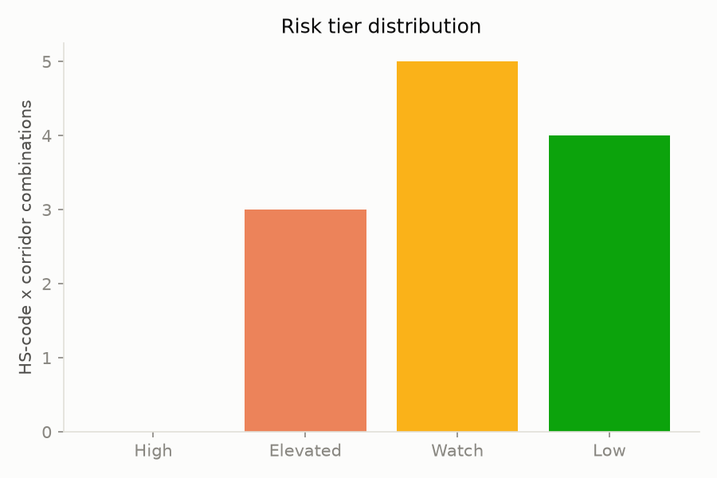
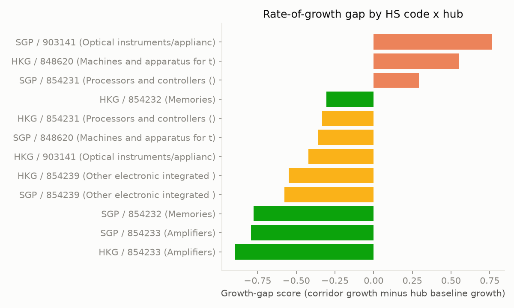
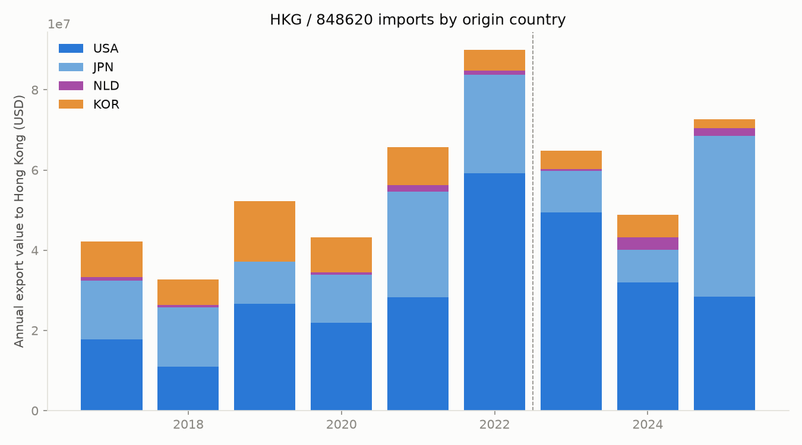

# Semiconductor Trade Diversion Risk: Singapore and Hong Kong

*UN Comtrade bilateral trade data, HS6-level, 2017-2025 (2026 excluded — incomplete
reporting year), against a live-pulled timeline of BIS/EAR export control actions
since October 2022.*

*Revision note: this memo was substantially reworked after an external
methodology review identified that the original "absorption gap" signal
double-counted China re-export concentration as two supposedly independent
pieces of evidence. The fix (splitting that into a destination-agnostic
retention signal and a separate China-concentration-trend signal) surfaced a
third Elevated-tier finding the original design had masked, and a second,
unrelated flow-direction bug in the monthly data pull was caught and fixed in
the same pass — see Section 7 and `src/build_risk_score.sql`'s revision note
for what changed and why.*

## 1. Recommendation

**Hong Kong's imports of semiconductor manufacturing equipment (HS 848620) are a
legitimate enhanced-due-diligence candidate; the analysis below does not establish
diversion, and two other HS-code/hub combinations that scored identically on the
mechanical screen do not hold up under the same scrutiny.** Three signals converge
on Hong Kong: import growth that has sharply outpaced the hub's own economy since
2022, a share of re-exports going to China that has climbed from 58% to 91% and
shows no sign of leveling off, and an import/re-export mismatch that gets *worse*,
not better, when tested against a multi-year inventory-timing lag. Growth also
concentrates somewhat in the two origin countries under the tightest coordinated
export-control regimes (the US and Netherlands), though not exclusively — Japan
grew more modestly and South Korea's exports of this equipment to Hong Kong
actually declined. What the data does *not* show is a sharp reaction to any single
BIS control date: a proper monthly event-window analysis around the October 2022
package shows trade *dipping* in the six months immediately after, not spiking,
before recovering over the following six months. That absence of a clean trigger
event is worth stating plainly rather than glossing over — this reads as a
sustained multi-year pattern, not a reactive one, which is if anything the more
durable (and harder to dismiss) kind of signal for a compliance program to track.

Two other HS-code/hub combinations — Singapore's optical inspection instruments
(HS 903141) and processors/controllers (HS 854231) — scored "Elevated" on the same
mechanical screen but do not survive rule-out to the same degree: neither shows
Hong Kong's rising China-concentration pattern, and Singapore's growth in both
categories tracks a real, independently documented, multi-billion-dollar domestic
fab capacity buildout.

## 2. The screen

Every HS-code/hub combination is scored on four independent signals — see
[`src/build_risk_score.sql`](../src/build_risk_score.sql) for the full logic, kept
in one auditable SQL file rather than a model:

1. **Rate-of-growth gap** — corridor import growth vs. the hub's own overall trade
   growth, pre- vs. post-2022.
2. **Retention gap** — hub imports minus ALL re-exports (any destination) minus an
   estimated domestic-consumption baseline. Positive means meaningful volume isn't
   leaving as re-export at all; negative means re-exports exceed imports.
3. **China concentration trend** — is the *share* of re-exports going to China
   both elevated and rising, independent of the retention gap's magnitude.
4. **Event proximity** — does growth cluster right after a BIS control date
   (annual-grain approximation; a proper monthly version is run separately for
   the top finding — see Section 3).

Two of four signals aligning tiers a row "Elevated"; three or four, "High."

| Tier | Count | HS x Hub |
|---|---|---|
| High | 0 | — |
| Elevated | 3 | SGP/903141, HKG/848620, SGP/854231 |
| Watch | 6 | HKG/854231, SGP/848620, HKG/903141, HKG/854239, SGP/854239 |
| Low | 4 | HKG/854232, SGP/854232, SGP/854233, HKG/854233 |

No combination hit three or four signals — worth naming honestly: with only 12
scored combinations and thresholds chosen by the analyst rather than calibrated
against a labeled outcome, the absence of a "High" tier is a useful sanity check
against indiscriminate flagging, not a statistically validated negative result.
Section 6 tests whether the three "Elevated" flags are robust to the specific
threshold choices, separately from this framing point.

**Design note on signal independence:** an earlier version of this screen defined
signal 2 as "imports minus re-exports *to non-China destinations*," which — with
the domestic-consumption placeholder at zero — algebraically reduces to *imports
minus total re-exports plus China re-exports*. A larger China re-export stream
mechanically inflated that number, while China's re-export concentration was
*also* used as separate qualitative rule-out evidence. Same underlying phenomenon,
counted twice across two nominally independent signals. The current retention-gap
signal (destination-agnostic) and China-concentration signal (share-based, not
volume-based) are now genuinely separable — a hub could score high on one and low
on the other, which the old formula couldn't distinguish. See Section 7 for the
full note.

## 3. Driver analysis: Hong Kong / HS 848620 (semiconductor manufacturing machines)

**The growth is real, large, sustained across three years, and increasingly
concentrated on China — but it is not a clean story, and it does not reduce to a
reaction to any single control date.**

- Total HK imports of HS 848620 from the world: $78.7M (2017) → $504.4M (2021) →
  $304.6M (2022, a dip) → **$1.08B (2023) → $2.11B (2024) → $3.04B (2025)**.
- China's share of HK's re-exports of this equipment: 39% (2018) → 63% (2021) →
  76% (2022) → 88% (2023) → 91% (2024) → **94% (2025)**. Averaged, 58.3%
  (2017-21) → 91.0% (2023+), a +32.7 percentage-point rise — the opposite of what
  you'd expect if Hong Kong were diversifying its re-export customer base *away*
  from China in response to controls.
- The USA-reported bilateral corridor (the slice of this growth directly
  attributable to declared US-origin equipment) shows the same direction: a 73%
  level increase in average annual value post-2022 vs. pre-2022, against Hong
  Kong's overall trade growing only 18% over the same comparison.

**Origin decomposition — is the growth broad-based, or concentrated in
controlled-origin suppliers?** Growth by actual exporting country, pre-2022 avg →
post-2022 avg:

| Origin | Pre-2022 avg/yr | Post-2022 avg/yr | Change |
|---|---|---|---|
| USA | $21.1M | $36.6M | +73% |
| Netherlands | $0.7M | $1.8M | +143% (small base) |
| Japan | $15.6M | $19.5M | +25% |
| South Korea | $9.7M | $4.2M | **-57%** |

Not a clean result either way. The two origins under the tightest coordinated
export-control regimes (the US, and the Netherlands via ASML-specific
restrictions) show the strongest growth, while Japan grew more modestly and South
Korea's exports of this equipment to Hong Kong *declined* — inconsistent with a
simple "Hong Kong's whole semiconductor-equipment economy is booming" explanation,
but also short of "growth is exclusively concentrated in controlled origins."
Taiwan is excluded (no standalone Comtrade reporter code, and not itself a major
equipment exporter for this HS code).

**Inventory-lag test — does the "re-exports exceed same-year imports" pattern
resolve at a 1-2 year lag** (capital equipment plausibly sits in inventory before
re-export)? It does not — if anything, it gets worse:

| Lag | Avg. re-export(China) / import ratio |
|---|---|
| Same year (t+0) | 1.29 |
| t+1 | 1.94 |
| t+2 | **3.47** |

A ratio that stays above 1.0 and *widens* at longer lags argues against simple
inventory timing as the full explanation. Plausible remaining explanations include
multi-year inventory dynamics beyond a 2-year window, valuation differences
between declared import and re-export values (installation, bundled services,
markups), or re-exports of equipment that entered Hong Kong via free-trade-zone
or bonded-transit arrangements not fully captured as formal imports in this data.
This is reported as an open, unresolved anomaly, not explained away.

**Event-window analysis — a real monthly test, not vertical lines on a chart.**
Average monthly USA→HKG trade value in six-month windows around the October 2022
BIS package's effective date:

| Window (months from event) | Avg. monthly value |
|---|---|
| [-12, -6) | $3.44M |
| [-6, -3) | $4.70M |
| [-3, 0) | $5.86M |
| **[0, +3)** | **$3.70M** |
| **[+3, +6)** | **$1.02M** |
| [+6, +12) | $6.71M |

This does **not** show a spike right after the controls — trade value *drops* in
the six months immediately following, then recovers to its highest level in
months 6-12 out. That's consistent with the annual event-proximity signal for
this row, which is negative (-0.659). Read plainly: the growth in this corridor is
better characterized as a sustained multi-year trend than a reaction to a specific
rule date, and this memo does not claim otherwise. (An earlier draft of this
chart, built before a flow-direction bug in the monthly fetch was caught and
fixed, showed a different and incorrect pattern — see Section 7.)

**Ruling out the alternatives:**
- *Legitimate domestic demand?* Hong Kong has no meaningful wafer-fab industry —
  its only active semiconductor manufacturing projects are small, early-stage SiC
  and GaN pilot lines (a ~$900M SiC fab targeting 240,000 wafers/year by 2028, a
  GaN pilot line targeting 10,000 units/year by 2027), nothing on the scale that
  would absorb billions of dollars a year in fab-grade manufacturing equipment.
  This alternative does not hold.
- *Legitimate re-export diversification to non-China buyers?* The opposite is
  happening — China's share of Hong Kong's re-exports of this equipment has risen
  every year since 2018. This alternative does not hold either.

**What this section does and doesn't establish:** the evidence is compelling at
the screening level — sustained above-baseline growth, rising and now-dominant
China concentration, no credible domestic-use explanation, and growth weighted
(not exclusively) toward the most tightly controlled origins. It is weaker at the
causal level — the retention/re-export mismatch is unresolved rather than
explained, and there is no clean single-event trigger to point to. "Warrants
enhanced due diligence" is a defensible conclusion from this data. "This is
diversion" is not.

## 4. Driver analysis: Singapore / HS 854231 (processors and controllers)

**This one doesn't survive the rule-out to the same degree.** The mechanical
screen flagged it on growth-gap and event-proximity signals (USA→Singapore
exports of this code jumped to $436M in 2025 vs. a $200M pre-2022 average), but:

- Singapore's re-exports of this code to China are a modest, *not rising* share
  of its total re-exports: 15.7% (2017-21 avg) → 18.1% (2023+ avg), a +2.4
  percentage-point change — nowhere near Hong Kong's +32.7-point rise, and the
  most recent single year (2025) is actually the lowest of the post-2022 period
  at 13.5%.
- Singapore's total imports of this code from the world are also growing fast
  ($11.5B in 2017 to $62.3B in 2025). That's consistent with — though does not by
  itself prove — a real, independently documented capacity buildout:
  GlobalFoundries' $4B Woodlands campus expansion (+300,000 wafers/year), UMC's
  $5B new fab (targeting >1M wafers/year by 2026), and Micron's newly-announced
  $24B Singapore fab (groundbreaking January 2026). The evidence here provides a
  substantially more credible domestic-demand explanation for Singapore than for
  Hong Kong — it does not, on its own, prove that these specific imported units
  are the ones being consumed domestically.
- The retention-gap signal for this row is strongly negative (-$12.8B):
  Singapore's re-exports of this code exceed its same-year imports by a wide
  margin, before any domestic-consumption offset.

**Conclusion: keep on the Watch list in spirit, not treated as equivalent to the
Hong Kong finding**, even though both currently tier as "Elevated" under the same
mechanical cutoffs (see Section 6). The volume growth is real, but the
China-concentration and domestic-demand rule-outs both hold up here in a way they
don't for Hong Kong.

## 5. Driver analysis: Singapore / HS 903141 (semiconductor inspection instruments)

This is the highest-growth-gap row in the entire dataset (+0.762) and newly
surfaced as "Elevated" by the corrected signal design — the original,
double-counted absorption-gap formula had obscured it. A lighter treatment than
Sections 3-4: origin decomposition and event-window analysis were not run for
this row in this pass (an explicit scope limitation, not an oversight — see
Section 7).

- China's share of Singapore's re-exports of this code: 25.5% (2017-21 avg) →
  36.8% (2023+ avg), a +11.4 percentage-point rise — real, but well short of Hong
  Kong's pattern, and the most recent year (2025, 31.1%) is below the 2024 peak
  (39.4%).
- The retention-gap signal is strongly negative (-$2.8B), consistent with the
  same entrepot/production-hub dynamic discussed for Singapore's other HS codes.
- Inspection instruments are a natural complement to the manufacturing-equipment
  capacity buildout discussed in Section 4 — the same expanding fabs
  (GlobalFoundries, UMC, Micron) need QA/inspection tooling alongside fab
  machinery. This is a reasonable inference given the pattern, not a
  independently verified claim the way the Hong Kong origin decomposition is.

**This row would benefit from the same deep-dive treatment given to Hong Kong's
finding before being acted on** — flagged here as a candidate for follow-up, not
resolved one way or the other in this pass.

## 6. Threshold sensitivity

The specific cutoffs in `build_risk_score.sql` (growth gap >15%, China
concentration >5 points, event proximity >10%) are analyst choices, not
calibrated values. Re-running the tier classification across 27 combinations of
reasonable alternative thresholds (growth: 10/15/20%; concentration: 3/5/8
points; event: 5/10/20%):

| HS x Hub | Elevated in | Watch in |
|---|---|---|
| HKG/848620 | **100%** of combinations | — |
| SGP/854231 | **100%** of combinations | — |
| SGP/903141 | **100%** of combinations | — |

All three "Elevated" classifications are robust to reasonable threshold choices —
none is an artifact of the specific cutoffs selected. This does not validate the
underlying signals themselves (a robust classification under a flawed signal
design is still flawed), but it does rule out "the result only holds because of
where the line was drawn."

## 7. Data-integrity check: Census vs. Comtrade

The US Census Bureau's export data (the US-reported side of these same corridors)
was pulled and compared against the Comtrade figures used above. The two match
closely: HKG/848620 matches to the exact dollar for every year 2017-2025, and
SGP/854231 matches within 0.001%. This confirms the fetch/parse pipeline
correctly reproduced the underlying US Census data (no transcription or
unit-conversion errors) — it is **not** an independent second-methodology
corroboration, since Comtrade's USA-reported figures are themselves sourced from
the US Census Bureau. A genuinely independent check would need Singapore's or
Hong Kong's *own* customs statistics (SingStat, for example) reporting the same
corridor from the receiving side — not run in this pass; see Section 8.

## 8. Recommendation, for two audiences

**For an authorized distributor's compliance function:** open enhanced due
diligence on Hong Kong counterparties transacting in HS 848620 (and related
semiconductor manufacturing/inspection equipment codes) where China is the
declared or likely re-export destination. Specifically: verify end-use
certificates and re-export licensing documentation for shipments routed through
Hong Kong in this category, and treat a customer's re-export mix concentrating
further toward China as a standing risk indicator worth periodic re-checking —
this is a multi-year trend, not a one-time screen result, so it should be
monitored the same way. Singapore counterparties in HS 854231 and HS 903141 do
not currently warrant the same elevated scrutiny; the processors/controllers
finding in particular has a well-documented legitimate-demand explanation. The
inspection-instruments finding (Section 5) is a lower-confidence flag pending
the deeper-dive treatment given to the Hong Kong finding.

**For a credit analyst assessing geopolitical/counterparty risk exposure:** a
portfolio with exposure to Hong Kong-domiciled electronics/semiconductor-equipment
trading counterparties carries rising regulatory and reputational tail risk in
this specific corridor — the trend (rising China concentration, absence of a
domestic-use explanation, robust to threshold choice) has been consistent for
three consecutive years, and BIS rulemaking activity in this space has itself
been sustained (17 title-confirmed semiconductor-relevant rule actions since
October 2022 in this pull alone). Don't anchor the underwriting narrative on a
single trigger event, though — the data doesn't support one, and a story that
requires a clean spike will not hold up to scrutiny the way the sustained-trend
framing does. Singapore-domiciled counterparties in the processor/controller and
inspection-instrument trades should be underwritten primarily on the fundamentals
of the real capacity buildout under way there (multi-billion-dollar fab
investments create their own counterparty-concentration and execution risk worth
tracking), not on a diversion narrative this data does not support.

## 9. Limitations

- **This is a screening methodology, not a finding of wrongdoing.** Correlation
  in aggregate trade data is not proof of illegal transshipment. Every flag above
  should be read as "worth a closer look," not "confirmed."
- **The methodology has sources of both false negatives and false positives —
  not only the former.** Aggregate customs data cannot see through a single
  re-export step (a shipment re-labeled in transit wouldn't appear as a
  hub-to-China flow at all, a structural source of false negatives). But the
  residual-based screening assumptions can also produce false positives: the
  zero domestic-consumption placeholder, import/export valuation differences,
  inventory-timing effects, HS misclassification, and treating China
  concentration as inherently diversion-consistent when it can also reflect
  ordinary demand concentration. Neither direction should be assumed to dominate
  without the follow-up work in this section.
- **The event-proximity signal (Section 2, signal 4) is annual-grain and
  fragile.** Nine annual observations is a thin base for an event-effect
  estimate; BIS control dates are not exogenous to trade trends already
  underway (governments tighten controls partly *because* trade patterns
  already concern them, which cuts against reading "control date, then growth"
  as evidence the control date *caused* the growth); and the
  "semiconductor_relevant" classification groups heterogeneous rule types
  (equipment controls, advanced-computing controls, Entity List actions) into
  one bucket based on a title-keyword filter, not a read of each rule's
  substance. The monthly event-window analysis in Section 3 is more defensible
  but was only run for the single top finding, as investigative follow-up on a
  flagged candidate — not as part of the ex-ante screen. Presenting it as
  confirmation of what the screen found, rather than as a separate,
  sequentially-later check, would overstate how independent that evidence is.
- **The origin decomposition and inventory-lag tests (Section 3) were run only
  for Hong Kong/848620.** The other two Elevated findings did not get the same
  depth of treatment in this pass — an explicit scope limitation.
- **HS classification is self-reported and inconsistent across countries at the
  6-digit level**, and Comtrade serves each year under whichever HS revision
  (H4/H5/H6) was in effect for that reporting period.
- **The domestic-consumption estimate is a 0-placeholder for both hubs**, not a
  researched dollar figure. Defensible for Hong Kong (negligible real fab
  capacity, confirmed by research, not assumed); understates Singapore's
  genuine domestic demand, which is why Singapore's retention-gap figures are
  treated as directional throughout, not literal.
- **The Census cross-check (Section 7) validates pipeline integrity, not
  independent corroboration.** SingStat and Hong Kong's own trade statistics —
  genuinely independent, receiving-side sources — were not pulled in this pass
  and remain the real open cross-validation step.
- **This project's own build process surfaced two flow-direction bugs** — one
  in the original annual bilateral pull (caught before it reached the scoring
  stage), and a second in the monthly fetch used for the event-window analysis
  (caught after it had already produced an incorrect chart and an incorrect
  "sharp spike" claim in an earlier draft of this memo, later corrected). Both
  are documented in `src/fetch_comtrade.py`'s code comments. Readers checking
  this analysis against the raw data should verify flow direction explicitly
  rather than assume it from a corridor's variable names.
